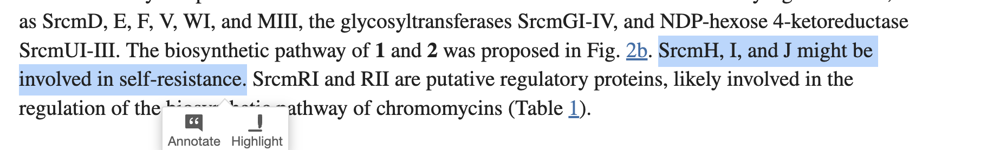

# Team Project Name

List of participants and affiliations:
- Maaly Nassar (Team Leader)
- Parul Sharma
- Dae-Young Kim
- Leonardo de Oliveira Martins, Quadram Institute Bioscience
- Participant, Affiliation

## Project Goals

Generate dataset of self-resistance genes with what up-/down-regulate them and train Machine Learning (ML) models to identify them in whole genomes

## Approach

## Results

## Future Work

## NCBI Codeathon Disclaimer
This software was created as part of an NCBI codeathon, a hackathon-style event focused on rapid innovation. While we encourage you to explore and adapt this code, please be aware that NCBI does not provide ongoing support for it.

For general questions about NCBI software and tools, please visit: [NCBI Contact Page](https://www.ncbi.nlm.nih.gov/home/about/contact/)

## draft notes 

### 2024.09.23
#### Main Deliverable
Generate dataset of self-resistance genes with what up-/down-regulate them and train ML models to identify them in whole genomes
#### Resources 
[BGCs dataset](https://gitlab.com/maaly7/bgc_discovery_for_t_cell_immunology/-/tree/master/data/training_dataset/emerald?ref_type=heads), 
[Hypothes.is](https://hypothes.is/groups/a27kDwg4/bgcs-molcon) (see screenshot of what the context looks like)

#### Milestones

* **Dae-Young Kim (Leroy)** (Tech Lead) to retrieve literature for self-resistance genes (from medline) and use LLMs and/or 
RAG (https://neo4j.com/labs/genai-ecosystem/llm-graph-builder/) to identify self-resistance genes in context,  their regulators and whole genome/BGCs accession numbers 
* **Parul Sharma** (Flex Lead) to download and generate training datasets from ncbi_pathogen_detect_amr AMR gene sequences to train a transformer model 
    * download ncbi_pathogen_detect_amr AMR protein/gene sequences of microbes
    * generate a list of AMR and non-AMR genes from microbe whole genome given ncbi_pathogen_detect_amr dataset
    * use this list to train transformer model
* **Leo Martins** (Writer lead) to parse the jsons in the BGCs dataset and identify microbes with self-resistance action with their BGCs accessions and publications. 
([Publication example](https://www.ncbi.nlm.nih.gov/pmc/articles/PMC5992853/), [microbe example](https://gitlab.com/maaly7/bgc_discovery_for_t_cell_immunology/-/blob/master/data/training_dataset/emerald/mibig3_emerald_4/MT459796.1.json))
Then, we will see given the size of the metadata what to do next. Retrieve more data from Leroy or use Parul's transformers to identify self-resistance one or use sequence similarity

#### Further links (regarding a transformer model)
* **Most popular framework in Python3**: https://huggingface.co/
* **Transformer in Hugging Face**: https://huggingface.co/docs/transformers/index
* **LLaMA in Hugging Face**: https://huggingface.co/docs/transformers/v4.44.2/en/model_doc/llama#overview
* **Microsoft GraphRAG info**: https://www.microsoft.com/en-us/research/blog/graphrag-unlocking-llm-discovery-on-narrative-private-data/ . Leroy believes we can identify our target entities (name of the bacterias, genes, accession number, etc. using GraphRAG.
