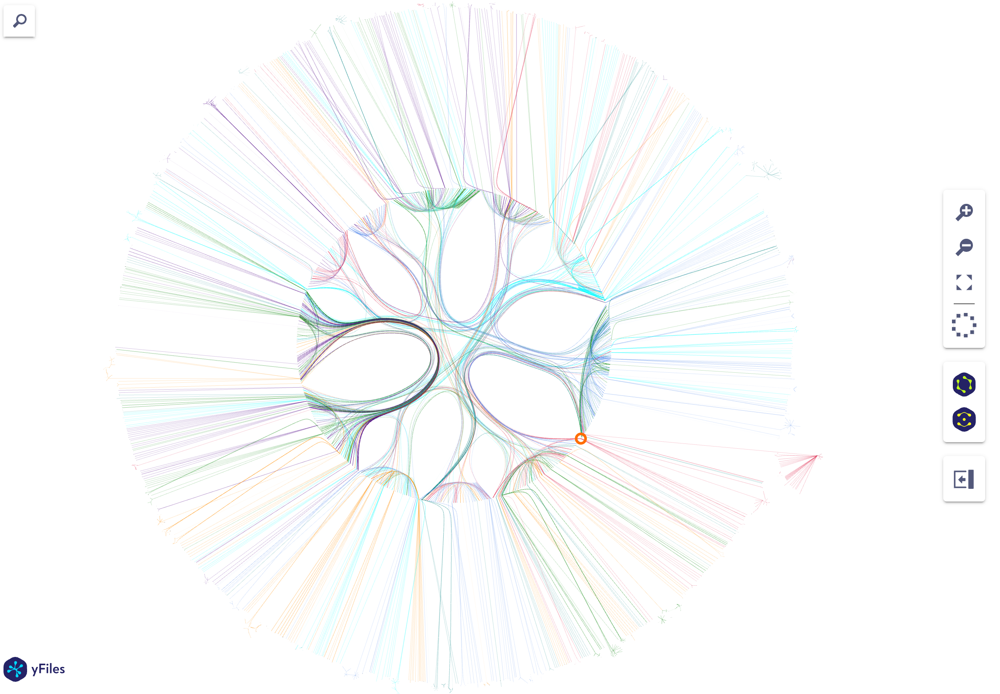

# GraphRAG with Abstract Section of Literatures


Bold green circle is the "self-resistance gene" node.

## Queries and Answers

### python -m graphrag.query --root . --method global "List name of all self-resistance genes"
```bash
creating llm client with {'api_key': 'REDACTED,len=164', 'type': "openai_chat", 'model': 'gpt-4o', 'max_tokens': 4000, 'temperature': 0.0, 'top_p': 1.0, 'n': 1, 'request_timeout': 180.0, 'api_base': None, 'api_version': None, 'organization': None, 'proxy': None, 'cognitive_services_endpoint': None, 'deployment_name': None, 'model_supports_json': True, 'tokens_per_minute': 150000, 'requests_per_minute': 10000, 'max_retries': 10, 'max_retry_wait': 10.0, 'sleep_on_rate_limit_recommendation': True, 'concurrent_requests': 25}

SUCCESS: Global Search Response:
```

### List of Self-Resistance Genes

The dataset provides a comprehensive list of self-resistance genes identified in various microorganisms. These genes play crucial roles in conferring resistance to the antibiotics or toxic compounds produced by the organisms themselves. Below is a detailed list of these self-resistance genes:

#### Streptomyces Species
- **DrrA, DrrB, DrrC**: Efflux pumps for daunorubicin and doxorubicin [Data: Reports (203, 296, 297, 300, 302, +more)].
- **SimX**: Efflux pump for simocyclinone [Data: Reports (214, 215)].
- **Hom12**: Methylates RNA to confer resistance to holomycin [Data: Reports (250, 432)].
- **Hyg21**: O-phosphotransferase for hygromycin A resistance [Data: Reports (222, 217)].
- **PenR**: Regulates biosynthesis and self-resistance of pentalenolactone [Data: Reports (333, 134)].
- **Mfs1**: Major facilitator superfamily transporter for natamycin [Data: Reports (427)].
- **LmrA, LmrB, LmrC**: Lincomycin resistance [Data: Reports (151, 154)].
- **FomA, FomB**: Fosfomycin resistance [Data: Reports (419, 422)].
- **OtrA, OtrB, OtrC**: Oxytetracycline resistance [Data: Reports (265, 263)].
- **DcsD, DcsE, DcsC, DcsG**: Self-resistance genes in Streptomyces lavendulae [Data: Reports (336)].
- **CmrA, CmrB, CmrX, CmmRII**: Self-resistance genes in Streptomyces griseus and Streptomyces albus [Data: Reports (182)].
- **DcsI, DcsJ**: Self-resistance determinants in the DCS biosynthetic gene cluster [Data: Reports (337)].
- **PikR1, PikR2**: Modify 23S rRNA for resistance to methymycin and neomethymycin [Data: Reports (55)].

#### Actinoplanes Species
- **VanH, VanA, VanX**: Modify peptidoglycan precursors for teicoplanin and vancomycin resistance [Data: Reports (105, 225)].
- **Tei Biosynthetic Gene Cluster**: Includes self-resistance genes for teicoplanin [Data: Reports (104)].

#### Bacillus Species
- **ZmaR**: High-level resistance to zwittermicin A [Data: Reports (342, 343, 339)].
- **YerP**: Surfactin self-resistance [Data: Reports (178)].
- **RhiB**: Threonine synthase for rhizocticin resistance [Data: Reports (259)].

#### Enterococcus faecalis
- **BacI1, BacI2**: Specific immunity factors for Bac41 [Data: Reports (79, 295)].

#### Amycolatopsis balhimycina
- **VanHAX**: Glycopeptide resistance [Data: Reports (224, 229)].

#### Nonomuraea Species
- **VanYn (Dbv7)**: Self-resistance mechanism [Data: Reports (294, 295)].
- **Dbv4, Dbv3**: Regulatory genes for A40926 biosynthesis and self-resistance [Data: Reports (76)].

#### Pezicula radicicola
- **Prfks1a, Prfks1n**: Echinocandin resistance [Data: Reports (115)].

#### Xenorhabdus nematophila
- **OatA**: Acetylates side chain amino groups for odilorhabdins resistance [Data: Reports (266, 267)].

#### Aspergillus fumigatus
- **GliT**: Self-resistance gene [Data: Reports (112)].

#### Cercospora Species
- **CFP, CnMFS2**: Cercosporin resistance [Data: Reports (207, 205, 206)].

#### Streptomyces platensis
- **PTMP3/PTNP3, FabF**: Resistance to platensimycin and platencin [Data: Reports (110)].

#### Streptomyces clavuligerus
- **SCLAV_4179**: Low-affinity penicillin-binding protein for β-lactam resistance [Data: Reports (367, 365)].
- **BLIP**: Modulates β-lactamase activity [Data: Reports (367)].

#### Lysobacter antibioticus
- **LexABC**: Efflux pump for myxin resistance [Data: Reports (418, 415)].

#### Paenibacillus larvae
- **PamZ**: N-acetyltransferase for paenilamicin resistance [Data: Reports (190)].

#### Cladobotryum Species
- **FrzK**: Enzyme evading inhibition by (-)-FR901483 [Data: Reports (318, 319)].

#### Fusarium Species
- **Self-resistance gene in 1233A biosynthetic gene cluster** [Data: Reports (275)].

#### Saccharopolyspora erythraea
- **ErmE**: Erythromycin resistance [Data: Reports (89)].

#### Penicillium citrinum
- **MlcE**: Increases resistance to statins [Data: Reports (51)].

#### Escherichia coli
- **Cph**: Resistance to capreomycin IIA and IIB [Data: Reports (243, 423)].
- **ORF21**: Aminoglycoside 3'-phosphotransferase for A-500359B resistance [Data: Reports (243)].

#### Additional Genes
- **VanY, VanXAb, VanYAb**: Glycopeptide resistance [Data: Reports (223, 224, 317)].
- **YtkR2**: Resistance to yatakemycin [Data: Reports (410, 409)].
- **Ecm16**: Resistance against quinomycin antibiotics [Data: Reports (304)].
- **SgvY**: Detoxifies viridogrisein [Data: Reports (258, 257)].
- **ClbS**: Hydrolytic inactivation of colibactin [Data: Reports (139)].
- **Kac338**: Acetyltransferase for kasugamycin resistance [Data: Reports (75)].
- **DauW**: Regulation of DNR biosynthesis and self-resistance [Data: Reports (86)].
- **Mur28**: Phosphotransferase for muraymycins resistance [Data: Reports (67)].
- **NepI/II**: ABC transporter for natamycin efflux [Data: Reports (426)].
- **CapP**: Resistance to A-503083S [Data: Reports (69, 242)].
- **C10R5**: Resistance against CC-1065 [Data: Reports (230)].
- **DabA, DabB**: Biosynthesis of 2,3-diaminobutyric acid [Data: Reports (332)].
- **MinD, MinA, MinCN, MinT**: Minimycin self-resistance [Data: Reports (42)].
- **KdpDE**: Regulatory system for efflux pump mechanisms [Data: Reports (92)].
- **ClpPADEP**: Resistance to ADEP antibiotics [Data: Reports (358)].

This extensive list highlights the diversity and complexity of self-resistance mechanisms across different microorganisms, ensuring their survival in the presence of their own toxic products.

## How to run it
```bash
cd literature_analysis/graphrag_abstract
python -m graphrag.index --init --root . # if not initialized
python -m graphrag.prompt_tune --root . --config ./settings.yaml --domain "self-resistance genes" --limit 10 --language English --max-tokens 2048 --chunk-size 256 --min-examples-required 3 --no-entity-types --output ./auto_tuning
python -m graphrag.index --root .
```
